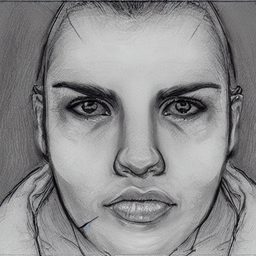
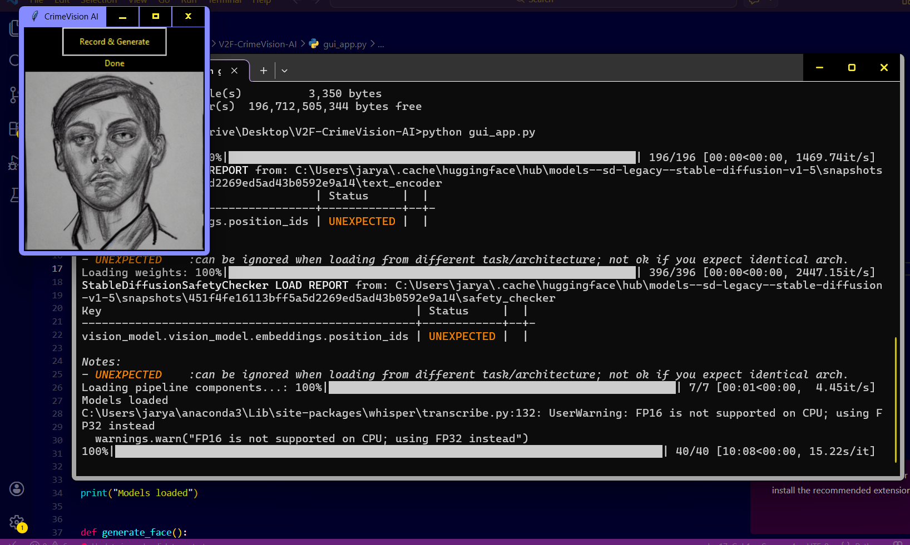

# 🚔 V2F-CrimeVision-AI

V2F-CrimeVision-AI is a multilingual AI-powered system that converts voice descriptions of suspects into realistic forensic-style face images.

---

## 🔍 Features

* 🎤 Voice Input (Hindi + English)
* 🧠 Speech-to-Text using Whisper
* 🌐 Automatic Translation (Hindi → English)
* 🎯 Smart Prompt Generation
* 🖼️ Face Generation using Stable Diffusion
* 💻 GUI Interface (Real-time)

---

## 📸 Demo

### 🔹 Generated Suspect Face

### 🔹 GUI Interface

---

## ⚙️ Tech Stack

* Python
* Whisper (Speech Recognition)
* Stable Diffusion
* Deep Translator
* Tkinter (GUI)

---

## 🚀 How It Works

1. User speaks suspect description
2. Audio is recorded and converted to text
3. Text is translated (if needed)
4. AI generates structured prompt
5. Stable Diffusion creates suspect face
6. Output displayed in GUI

---

## ⚠️ Note

This project is under active development. Advanced optimizations and improvements are ongoing.

---

## 📌 Future Scope

* Multi-language expansion (regional Indian languages)
* Web-based deployment
* Integration with law enforcement systems

---

⭐ If you like this project, consider giving it a star!
